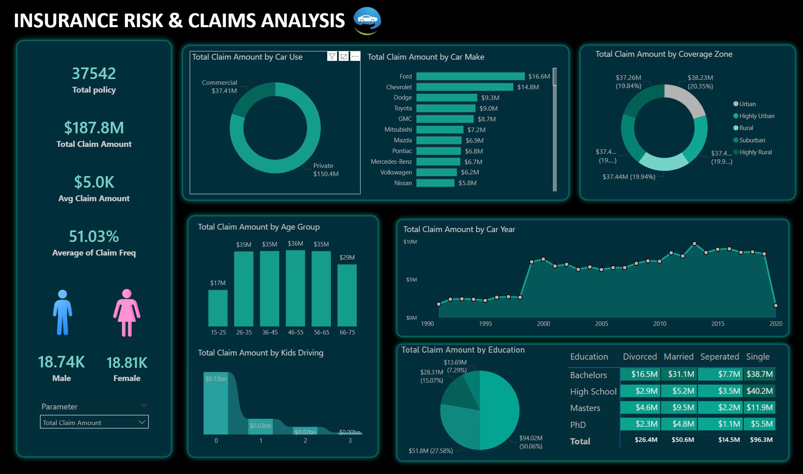

# 🚗 Insurance Risk & Claims Analysis Dashboard

## 📊 Project Overview

The **Insurance Risk & Claims Analysis Dashboard** is an interactive Power BI project designed to analyze insurance policies, claim amounts, customer demographics, vehicle characteristics, and risk-related patterns.

The dashboard provides a consolidated view of key insurance metrics and helps identify trends across car usage, vehicle brands, coverage zones, age groups, car years, education levels, and customer demographics.

---

## 🎯 Project Objective

The main objective of this project is to transform insurance claim data into meaningful business insights using **Power BI, Power Query, and DAX**.

The dashboard helps stakeholders:

- Monitor overall claim performance
- Analyze claim amounts across different customer segments
- Identify high-claim vehicle brands
- Compare claims by car usage
- Analyze claim trends across vehicle years
- Understand customer demographics
- Identify patterns based on age, education, and driving behavior

---

## 🛠️ Tech Stack

- **Power BI** – Dashboard development and data visualization
- **Power Query** – Data cleaning and transformation
- **DAX** – Measures and calculated metrics
- **CSV** – Data Source
- **GitHub** – Project documentation and portfolio

---

## 📌 Key KPIs

The dashboard tracks important insurance metrics including:

- **Total Policies:** 37,542
- **Total Claim Amount:** $187.8M
- **Average Claim Amount:** $5.0K
- **Average Claim Frequency:** 51.03%
- **Male Policyholders:** 18.74K
- **Female Policyholders:** 18.81K

---

## 📈 Dashboard Features & Highlights

### 1. Claim Analysis by Car Usage
Analyzes claim amounts based on how vehicles are used, such as:

- Private
- Commercial

### 2. Claim Analysis by Car Make
Identifies vehicle brands generating the highest claim amounts.

### 3. Coverage Zone Analysis
Compares total claim amounts across different coverage zones:

- Urban
- Highly Urban
- Rural
- Suburban
- Highly Rural

### 4. Age Group Analysis
Analyzes claim amounts across different customer age groups.

### 5. Car Year Analysis
Tracks claim amount trends based on vehicle manufacturing year.

### 6. Kids Driving Analysis
Analyzes claim amounts based on the number of kids driving the insured vehicle.

### 7. Education Analysis
Examines claim amounts across different education levels.

### 8. Demographic Analysis
Provides insights into:

- Gender distribution
- Education
- Marital status
- Customer characteristics

---

## 🔍 Key Insights

- **Private-use vehicles** contribute significantly higher claim amounts compared with commercial-use vehicles.
- **Ford** records the highest claim amount among the displayed car brands.
- Claim amounts are distributed across different coverage zones, allowing comparison of geographic risk patterns.
- Customers in the **26–65 age range** contribute a significant portion of total claim amounts.
- Claim trends vary considerably across different vehicle manufacturing years.
- The dashboard provides a clear comparison of claim amounts across **education and marital-status categories**.
- Male and female policyholders have a relatively balanced distribution.

---

## 📊 Dashboard Preview

### Insurance Risk & Claims Analysis

---

## 💡 Business Value

This dashboard can help insurance organizations:

- Identify high-risk customer and vehicle segments
- Monitor claim exposure
- Understand customer demographics
- Analyze vehicle-related claim patterns
- Support risk assessment and decision-making
- Improve insurance portfolio monitoring

